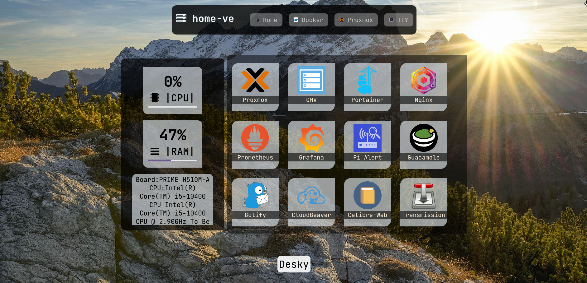
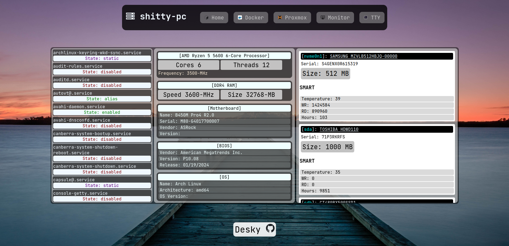
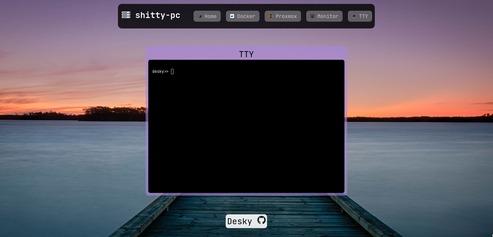

# Desky 


       /$$$$$$$                      /$$                
      | $$__  $$                    | $$                
      | $$  \ $$  /$$$$$$   /$$$$$$$| $$   /$$ /$$   /$$
      | $$  | $$ /$$__  $$ /$$_____/| $$  /$$/| $$  | $$
      | $$  | $$| $$$$$$$$|  $$$$$$ | $$$$$$/ | $$  | $$
      | $$  | $$| $$_____/ \____  $$| $$_  $$ | $$  | $$
      | $$$$$$$/|  $$$$$$$ /$$$$$$$/| $$ \  $$|  $$$$$$$
      |_______/  \_______/|_______/ |__/  \__/ \____  $$
                                               /$$  | $$
                                              |  $$$$$$/
                                               \______/ 

My own dashboard for homelab server.
Made for pratice and common usage, no more.


Working with:
- tty
- docker
- web self-hosted apps
- proxmox

## Install

To build project and run:

```bash
go build ./cmd/desky/...
./desky
```


## Settings ./init

App list configuration.
```json
apps.json
[
    {
        "name": "Proxmox",
        "icon": "proxmox",
        "url": "https://url.to.proxmox",
        "description": "Proxmox VE"
    },
    {
        "name": "OMV",
        "icon": "openmediavault",
        "url": "http://url.to.omv",
        "description": "OpenMediaVault System."
    },
    {
        "name": "Portainer",
        "icon": "portainer",
        "url": "http://url.to.portainer",
        "description": "Portainer Docker assist."
    }
]
```

Systemd service file.
```
[Unit]
Description=Desky dashboard.
After=network.target


[Service]
Type=simple
User=root

ExecStart=/root/desky/desky
WorkingDirectory=/root/desky

Restart=always
RestartSec=15


[Install]
WantedBy=default.target
```

## Screenshoots

Main apps


System info


TTY cmd


## License

[MIT](https://choosealicense.com/licenses/mit/)

